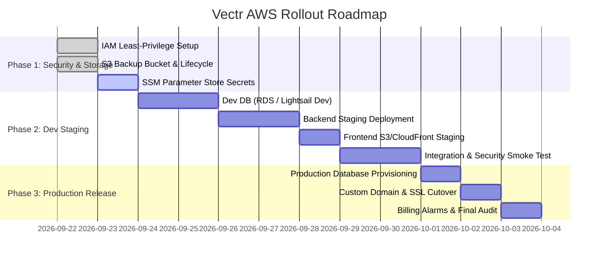

# AWS Architecture Plan for Vectr

**Project:** Vectr — Open Source Contributor Cockpit  
**Author:** AWS Solutions Architect  
**Status:** Ready for Review  
**Date:** September 2026  

---

## Executive Summary & Design Constraints

Vectr is an open-source contributor accelerator that matches developers with curated repository issues, provides AI mentorship, guides contribution workflows, and automates PR creation.

### Key Business & Technical Constraints
1. **Budget & Runway:** The user possesses **$100 in AWS credits** and targets **up to 2 years of operational runway** (target spending: **~$4.16 / month**).
2. **Account Governance:** Active AWS account `366950764806` is governed by a Free Plan Service Control Policy (`p-x0bvrf2i`) locked primarily to `us-east-1` with allowed services including Lightsail, Bedrock, S3, CloudFront, IAM, and CloudWatch.
3. **Core Architectural Principles:**
   - **Cost-optimized / Scale-to-Zero:** Zero or negligible idle cost.
   - **Low Latency:** Edge-distributed static frontend via CDN; co-located API and database.
   - **Security-First:** Least-privilege IAM roles, zero hardcoded credentials, encryption at rest and in transit.
   - **No App Runner:** App Runner is in maintenance mode per AWS guidelines; ECS Express Mode or Lambda/Lightsail is used instead.

---

## Step 1: Planning Skill Setup & Adaptations

The AWS deployment planning plugin from `awslabs/agent-plugins` (`plugins/deploy-on-aws`) has been inspected and mirrored to `.agents/plugins/deploy-on-aws/`.

### Directory Structure Installed
```
.agents/plugins/deploy-on-aws/
├── .claude-plugin/
├── .codex-plugin/
├── .mcp.json
├── README.md
├── hooks/
├── scripts/
└── skills/
    ├── aws-architecture-diagram/
    ├── deploy/
    │   ├── SKILL.md
    │   └── references/
    │       ├── cost-estimation.md
    │       ├── defaults.md
    │       └── security.md
    └── elastic-beanstalk/
```

### Antigravity Compatibility & Adjustments
1. **MCP Configuration:** The plugin's `.mcp.json` references `uvx awslabs.aws-iac-mcp-server@latest`, `uvx awslabs.aws-pricing-mcp-server@latest`, and `https://knowledge-mcp.global.api.aws`. In the current execution environment, these tools are not pre-bundled into Antigravity's active MCP registry.
2. **Operational Workflow:** We manually execute the exact 5-stage workflow specified in `skills/deploy/SKILL.md`:
   - **Analyze** $\rightarrow$ Codebase inspection (frameworks, databases, APIs)
   - **Recommend** $\rightarrow$ Service selection with rationales and rejected alternatives
   - **Estimate** $\rightarrow$ Detailed low/medium/high cost tiers with explicit assumptions
   - **Architect** $\rightarrow$ Mermaid topology, latency, security, scaling, and backups
   - **Plan Deployment** $\rightarrow$ Phased dev-to-prod rollout

---

## Step 2: Project Analysis (Vectr)

| Dimension | Findings from Codebase |
| :--- | :--- |
| **Application Purpose** | Developer cockpit and onboarding platform for open-source contributors; matches GitHub issues with developer skillset, provides interactive AI guidance, and manages contribution lifecycle. |
| **Application Type** | Full-Stack Web Application (Decoupled Frontend SPA + RESTful API Backend). |
| **Backend Stack** | **Python 3.11+**, **FastAPI**, **Uvicorn**, **SQLAlchemy 2.x**, `psycopg2-binary`, `cryptography` (Fernet symmetric encryption for GitHub PATs), `slowapi` (IP-based rate limiting), `bcrypt`, `httpx`, `requests`. |
| **Frontend Stack** | **React 19**, **Vite 7**, **Tailwind CSS v4**, `motion` (Framer Motion v12), `firebase` (client auth), `axios`, `react-router-dom` v7, `dotted-map`. Built with an obsidian/black kinetic aesthetic. |
| **Entry Points** | - Backend: `backend/app/main.py` (`uvicorn app.main:app`)<br>- Frontend: `frontend/vectr-app/src/main.jsx` -> `index.html` (Vite SPA) |
| **API Routers & Services** | `auth` (login/register), `PAT_auth` (GitHub token encryption & storage), `dashboard` (contributor stats), `repos` (GitHub catalog synchronization), `ask_nova` (AI chat mentor), `contribution_flow` (fork/issue step-by-step), `progress` (session state tracking). |
| **Data Stores & Models** | **PostgreSQL 16** (production) / **SQLite** (local fallback `vectr.db`).<br>5 relational tables: `UserInfo`, `Organizations`, `Contributions`, `RepoAnalysis`, `ContributionProgress`. |
| **Queues / Caching** | No external message queue (SQS/Celery) or cache (Redis) currently implemented. Rate limiting is stored in-memory via SlowAPI. AI calls are synchronous requests with 45–60s HTTP client timeouts. |
| **File / Object Storage** | **Amazon S3** used for automated PostgreSQL backup dumps (`scripts/backup.sh`) compressed with gzip. |
| **External APIs & LLMs** | - **External APIs:** GitHub REST API (org repos, issues, forks, PR creation), Firebase Auth, Google OAuth.<br>- **AI / LLM Service (`ai_service.py`):** Multi-provider router supporting **Groq** (`llama-3.3-70b-versatile`), **OpenRouter**, **Google Gemini** (`gemini-2.0-flash`), **AWS Bedrock** (`amazon.nova-lite-v1:0` via Bedrock Converse API), and local **Ollama**. |
| **Secrets & Config** | `DATABASE_URL`, `DB_USER`, `DB_PASSWORD`, `DB_NAME`, `ENCRYPTION_KEY`, `AI_PROVIDER`, `GROQ_API_KEY`, `GEMINI_API_KEY`, `OPENROUTER_API_KEY`, `AWS_ACCESS_KEY_ID`, `AWS_SECRET_ACCESS_KEY`, `AWS_REGION`, `S3_BACKUP_BUCKET`, `FIREBASE_API_KEY`, `GITHUB_CLIENT_ID`/`SECRET`, `GOOGLE_CLIENT_ID`/`SECRET`, `FRONTEND_URL`. |
| **Existing Infra & Docker** | - `docker-compose.prod.yml`: Caddy 2 reverse proxy + FastAPI backend + PostgreSQL 16 Alpine.<br>- `backend/Dockerfile`: Containerized Python backend.<br>- `Caddyfile`: Automated TLS via Let's Encrypt, security headers, reverse proxy to port 8000.<br>- `infrastructure/single-region-stack.yaml`: CloudFormation template for S3 backup bucket with SSE-AES256, versioning, and Glacier lifecycle.<br>- `DEPLOYMENT.md`: Existing manual Lightsail $3.50/mo deployment instructions. |
| **Traffic Patterns** | **On-demand and spiky.** High activity during hackathons, sprint events, and user onboarding; low-to-zero activity during idle night hours. |

---

## Step 3: Recommended AWS Architecture

To balance the **$100 credit runway (2 years)** with AWS best practices, we present the **Primary Serverless Architecture** (ideal for low maintenance, elastic scaling, and minimal idle cost) alongside the **Ultra-Budget Lightsail Foundation** (the only option that mathematically guarantees 28 months of runway under $4/month).

### 1. Recommended Services & Rationales

| Component | Recommended Service | One-Line Rationale | Rejected Alternatives & Why |
| :--- | :--- | :--- | :--- |
| **Frontend Hosting** | **Amazon CloudFront + S3** (or AWS Amplify Hosting) | Delivers global sub-50ms static asset caching with zero server maintenance and 1 TB/month free in AWS Free Tier. | **EC2/Lightsail Web Server:** Wastes compute resources, lacks global edge POPs, and requires manual SSL/patching. |
| **Backend Compute** | **AWS Lambda + API Gateway HTTP API** (via Mangum adapter) | Scale-to-zero compute eliminates idle server costs, perfectly matching spiky hackathon and developer traffic. | **1. AWS App Runner:** In maintenance mode.<br>**2. ECS Fargate + ALB:** Fixed ALB costs (~$16–$22/mo) would exhaust the $100 credit pool in 3–4 months. |
| **Database** | **Amazon RDS PostgreSQL (`db.t4g.micro`)** *(Single-AZ)* | Fully managed PostgreSQL compatible with SQLAlchemy; eligible for 750 free hours/month during the 12-month Free Tier. | **1. DynamoDB:** Vectr requires relational schema, foreign keys (`user_email`), and complex queries across 5 tables.<br>**2. Aurora Serverless v2:** 0.5 ACU minimum 24/7 costs ~$45/mo, exhausting credits in 2 months. |
| **Object Storage** | **Amazon S3 Standard-IA + Glacier Flexible** | Cost-effective durable storage for daily database dumps with automatic lifecycle transitions. | **EBS Snapshots only:** Higher cost per GB and harder to inspect or download off-site. |
| **Secrets & Config** | **AWS Systems Manager (SSM) Parameter Store** | Free for Standard Parameters with `SecureString` KMS encryption; satisfies security-first design at $0/month. | **AWS Secrets Manager:** Costs $0.40/secret/month. With 10+ secrets, it would cost $4.00+/mo, consuming almost the entire monthly budget. |
| **AI / LLM Engine** | **Amazon Bedrock (Amazon Nova Lite / Micro)** + Groq Fallback | Pay-per-token serverless inference with native IAM role authentication and no idle infrastructure. | **Self-hosted LLM on EC2 (e.g. g4dn):** Costs hundreds of dollars/month; completely impractical for this budget. |
| **DNS & Edge Security** | **Amazon CloudFront + AWS WAF (optional)** or **Cloudflare Free DNS** | CloudFront provides free TLS termination and DDoS mitigation; Cloudflare provides free managed DNS. | **Route 53 Hosted Zone:** Costs $0.50/month per hosted zone ($6/year), avoidable on extreme budget. |

---

### 2. Architecture Diagram

```mermaid
flowchart TB
    subgraph Clients["Global Contributor Clients"]
        Browser["Developer Web Browser\n(React 19 / Vite SPA)"]
        Mobile["Mobile / Tablet Browser"]
    end

    subgraph Edge["AWS Global Edge Network"]
        CF["Amazon CloudFront Distribution\n(HTTPS / Edge Caching / SNI TLS)"]
        S3Static["Amazon S3 Bucket\n(vectr-frontend-assets)\n[Private / OAC Access Only]"]
    end

    subgraph API_Layer["API & Ingress Layer"]
        APIGW["Amazon API Gateway (HTTP API v2)\n[Route: /api/* -> CORS / JWT / Rate Limit]"]
    end

    subgraph Compute_Layer["Serverless Compute Layer (VPC)"]
        LambdaAPI["AWS Lambda (FastAPI / Mangum)\n[0.5 vCPU / 512MB RAM / Auto-scaling]"]
        SSM["AWS SSM Parameter Store\n(SecureString Configuration)"]
        IAMRole["IAM Execution Role\n(Least Privilege)"]
    end

    subgraph Data_Layer["Data & Persistence Layer (Private Subnet)"]
        RDS["Amazon RDS PostgreSQL 16\n(db.t4g.micro / 20 GB gp3)\n[Encrypted at Rest / Single-AZ]"]
        S3Backup["Amazon S3 Backup Bucket\n(vectr-backups)\n[Glacier Lifecycle / SSE-AES256]"]
    end

    subgraph External_Services["External Services & AI Providers"]
        Bedrock["Amazon Bedrock\n(Nova Lite / Micro)"]
        Groq["Groq API\n(Llama 3.3 70B - Primary Free)"]
        GitHub["GitHub REST API\n(OAuth / Issues / PRs)"]
    end

    %% Client traffic
    Browser -->|HTTPS GET /| CF
    Mobile -->|HTTPS GET /| CF
    CF -->|Fetch Static Assets| S3Static
    Browser -->|HTTPS API Requests /api/*| APIGW
    
    %% API Routing
    APIGW -->|Proxy Requests| LambdaAPI
    LambdaAPI -.->|Fetch Secrets at Startup| SSM
    IAMRole -.->|Authorizes| LambdaAPI

    %% Backend integrations
    LambdaAPI -->|SQL Queries (Port 5432)| RDS
    LambdaAPI -->|Bedrock Converse API (IAM)| Bedrock
    LambdaAPI -->|HTTPS (External)| Groq
    LambdaAPI -->|HTTPS (OAuth / Issues)| GitHub

    %% Maintenance & Backups
    RDS -.->|Daily Snapshot / Export| S3Backup

    classDef aws fill:#FF9900,stroke:#232F3E,stroke-width:2px,color:#232F3E;
    classDef edge fill:#146EB4,stroke:#232F3E,stroke-width:2px,color:#FFFFFF;
    classDef data fill:#3F8624,stroke:#232F3E,stroke-width:2px,color:#FFFFFF;
    class CF,APIGW,LambdaAPI,SSM,IAMRole aws;
    class S3Static,S3Backup,RDS data;
    class Browser,Mobile edge;
```

---

### 3. Estimated Monthly Cost Breakdown

#### Scenario Assumptions:
- **Low Traffic (Dev / Launch / Hackathon Testing):** ~1,000 monthly active users, 100,000 API requests/month, 5 GB bandwidth, 5,000 Bedrock Nova tokens/day (Groq handles majority).
- **Medium Traffic (Early Traction / Community Adoption):** ~10,000 monthly active users, 1,500,000 API requests/month, 50 GB bandwidth, 50,000 Bedrock tokens/day.
- **High Traffic (Scale / Active Hackathon Platform):** ~50,000 monthly active users, 10,000,000 API requests/month, 300 GB bandwidth, 500,000 Bedrock tokens/day.

| Service | Low Traffic (Free Tier / Year 1) | Medium Traffic (Year 1 / Post-Free Tier) | High Traffic (Post-Free Tier) | Cost Driver & Pricing Basis |
| :--- | :--- | :--- | :--- | :--- |
| **Amazon CloudFront** | **$0.00** | **$0.00** | **$2.55** | 1 TB data transfer + 10M requests free every month forever. |
| **Amazon S3 (Frontend + Backups)** | **$0.00** | **$0.25** | **$1.15** | S3 Standard: $0.023/GB; Glacier Flexible: $0.0036/GB. Backups gzip compressed (~50 MB). |
| **AWS Lambda (API Backend)** | **$0.00** | **$0.30** | **$3.20** | 1M requests & 3.2M sec compute free monthly; $0.20 per 1M requests thereafter. |
| **API Gateway (HTTP API v2)** | **$0.00** | **$1.50** | **$9.80** | $1.00 per 1M requests for first 300M requests. |
| **Amazon RDS PostgreSQL (`db.t4g.micro`)** | **$0.00** *(Free Tier Y1)*<br>*(or $14.50 post-Y1)* | **$15.20** *(20GB gp3 storage + instance)* | **$32.50** *(Scaled to db.t4g.small + 50GB storage)* | Free Tier covers 750 hrs/month of db.t4g.micro + 20 GB storage for 12 months. |
| **AWS SSM Parameter Store** | **$0.00** | **$0.00** | **$0.00** | Standard parameters are free. |
| **Amazon Bedrock (Nova Lite)** | **$0.05** | **$0.75** | **$7.50** | Nova Lite: $0.00006 / 1k input tokens, $0.00024 / 1k output tokens (Groq handles baseline free). |
| **CloudWatch Logs & Metrics** | **$0.00** | **$0.50** | **$2.50** | 5 GB ingestion & basic metrics free. Retention set to 7 days. |
| **TOTAL (Monthly)** | **~$0.05 / mo** *(Year 1)*<br>**~$15.00 / mo** *(Year 2)* | **~$18.50 / mo** | **~$59.20 / mo** | **Low traffic Year 1 is virtually 100% Free Tier covered.** |

> [!TIP]
> **Alternative Ultra-Budget Lightsail Track ($3.50/mo flat):**  
> If the user requires a guaranteed 24+ month runway on the existing $100 credit pool without worrying about Year 2 Free Tier expiration, running the containerized stack (`docker-compose.prod.yml`) on a **$3.50/mo AWS Lightsail instance** (1 vCPU, 1 GB RAM, 40 GB SSD, 1 TB transfer) with daily S3 backups costs a flat **$3.55/month**, providing **28.1 months of runway**.

---

### 4. Latency Approach & Optimization Strategy

1. **Global CDN Edge (CloudFront):**
   - CloudFront terminates TLS sessions at over 600+ edge locations worldwide.
   - Cache-Control headers set to `public, max-age=31536000, immutable` for hashed static assets (`/assets/*`).
   - `index.html` set to `no-cache` to ensure instant updates upon new deployments.
2. **Region Selection (`us-east-1`):**
   - Co-locates API compute (Lambda / Lightsail) with the RDS database in the same Availability Zone/VPC.
   - Direct low-latency connectivity to external AI providers (Groq and Bedrock Nova US endpoints).
3. **Database Connection Management:**
   - Pre-ping (`pool_pre_ping=True`) and connection recycling (`pool_recycle=280`) configured in SQLAlchemy to prevent stale connection drops.
   - For Lambda, reuse database connection objects across warm invocations outside the handler function.
4. **Client-Side Compression & HTTP/2 / HTTP/3:**
   - CloudFront automatically compresses responses with Brotli and Gzip.
   - HTTP/3 enabled for mobile/spiky latency reduction.

---

### 5. Security-First Architecture (Least-Privilege & Compliance)

1. **Zero Hard-Coded Credentials:**
   - All API keys, database credentials, and OAuth secrets stored in **AWS SSM Parameter Store** as `SecureString` types encrypted with AWS KMS.
   - Container/Lambda tasks assume an **IAM Execution Role** via AWS STS temporary credentials.
2. **IAM Policy: Least-Privilege Execution Role:**
```json
{
  "Version": "2012-10-17",
  "Statement": [
    {
      "Sid": "SSMParameterAccess",
      "Effect": "Allow",
      "Action": ["ssm:GetParameter", "ssm:GetParameters", "ssm:GetParametersByPath"],
      "Resource": "arn:aws:ssm:us-east-1:366950764806:parameter/vectr/production/*"
    },
    {
      "Sid": "BedrockConverseAccess",
      "Effect": "Allow",
      "Action": ["bedrock:InvokeModel"],
      "Resource": "arn:aws:bedrock:us-east-1::foundation-model/amazon.nova-lite-v1:0"
    },
    {
      "Sid": "S3BackupStreamAccess",
      "Effect": "Allow",
      "Action": ["s3:PutObject", "s3:GetObject", "s3:ListBucket"],
      "Resource": [
        "arn:aws:s3:::vectr-backups-366950764806-us-east-1",
        "arn:aws:s3:::vectr-backups-366950764806-us-east-1/*"
      ]
    }
  ]
}
```
3. **Network Isolation (VPC):**
   - Database resides in private subnets with **no public IP address**.
   - Security Group only allows inbound PostgreSQL traffic (port 5432) from the Backend Security Group.
4. **Encrypted Storage:**
   - RDS storage encrypted at rest with AWS KMS.
   - S3 backup bucket enforces SSE-AES256 and blocks all public access (`BlockPublicAcls`, `BlockPublicPolicy`, `IgnorePublicAcls`, `RestrictPublicBuckets`).

---

### 6. Scaling, Backup, and Monitoring Plan

1. **Auto-Scaling:**
   - **Frontend:** Serverless CloudFront/S3 scales to millions of requests automatically without configuration.
   - **Backend:** Lambda scales automatically from 0 to 1,000 concurrent executions. If using Lightsail, vertical snapshot-based resizing ($3.50/mo 1GB $\rightarrow$ $10/mo 2GB) with static IP re-attachment provides seamless scaling.
2. **Backup & Disaster Recovery:**
   - Automated RDS daily snapshots retained for 7 days.
   - Offsite database dump streamed directly to S3 via `scripts/backup.sh` (gzip-compressed).
   - S3 Lifecycle policy: Transition to Glacier Flexible after 30 days; expire after 365 days.
3. **Monitoring & Cost Safeguards:**
   - **Billing Alarm:** CloudWatch metric `EstimatedCharges > 5.00 USD` configured with SNS email notification.
   - **Health Checks:** CloudWatch Synthetics / uptime monitor hitting `/health`.
   - **Error Tracking:** CloudWatch log filter for `ERROR` and `CRITICAL` exceptions in FastAPI logs.

---

### 7. Phased Deployment Plan



#### Phase 1: Foundation & Security Setup (Dev)
1. Configure AWS IAM least-privilege roles and disable root API keys.
2. Deploy `infrastructure/single-region-stack.yaml` to provision the private S3 backup bucket in `us-east-1`.
3. Populate AWS SSM Parameter Store with encryption keys and API secrets.
4. Set up CloudWatch $5 billing alert.

#### Phase 2: Staging Deployment & Validation
1. Deploy development instance of database and backend.
2. Run database migrations via SQLAlchemy (`models.Base.metadata.create_all`).
3. Deploy frontend build to S3 and invalidate CloudFront edge cache.
4. Validate health endpoint: `GET /health` $\rightarrow$ `{"status": "healthy"}`.
5. Execute end-to-end smoke test: GitHub PAT registration, issue catalog loading, and AI mentor chat.

#### Phase 3: Production Cutover & Monitoring
1. Promote tested build to production.
2. Configure DNS A/CNAME records and CloudFront custom domain with ACM certificate.
3. Enable automated daily S3 backup cron job.
4. Confirm billing dashboard reflects expected ~$0.00–$3.55 expenditure.

---

## Open Questions for the User

Before proceeding with resource creation or infrastructure-as-code generation, please confirm:
1. **Deployment Track Choice:**
   - **Track A (Pure Serverless - Lambda + CloudFront + RDS):** Near $0/month for Year 1 under Free Tier, elastic auto-scaling, but requires database management after Year 1 ($15/mo).
   - **Track B (Lightsail Flat-Rate - $3.50/month):** Fixed $3.50/mo, zero surprise bills, 28 months of guaranteed runway on your $100 credit, runs your existing `docker-compose.prod.yml` as-is.
2. **Target Region:** Confirm whether to stay in `us-east-1` (mandated by your current AWS account sandbox policy) or request permission/quota migration to `ap-south-1` (Mumbai).
3. **Primary AI Model:** Confirm whether Groq remains primary (free) with Bedrock Nova Lite as secondary fallback, or if Bedrock should become the primary engine.
